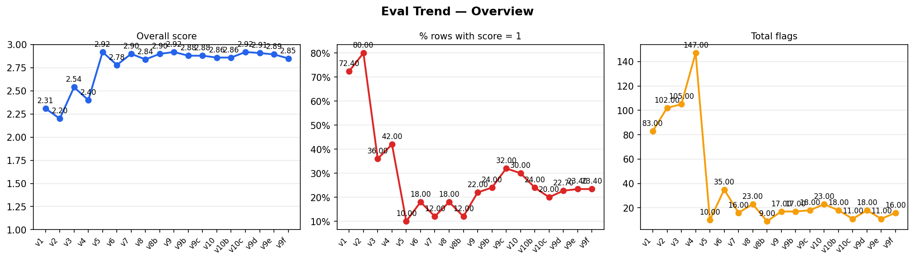
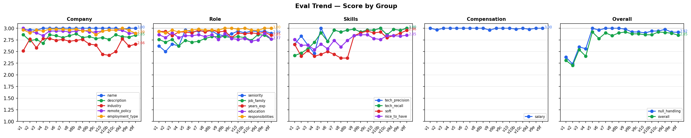
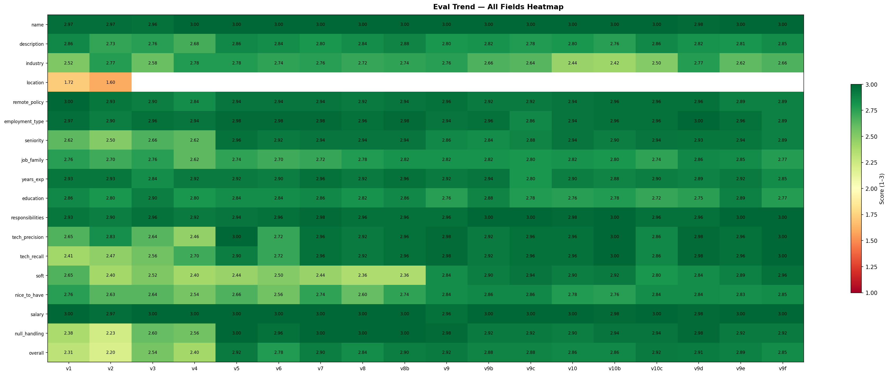

# AI-JIE — Automated Job Information Extraction

An end-to-end pipeline for extracting, evaluating, and versioning structured data from raw job postings using LLMs.

---

## Overview

AI-JIE takes raw job posting text and produces structured records — company, role, skills, and compensation — ready for downstream analysis. It includes a full evaluation framework using LLM-as-a-Judge to measure and iteratively improve extraction quality.

**Stack**: Python · OpenAI (`gpt-5.4-mini` for extraction and evaluation) · `instructor` · `asyncio` · HuggingFace Hub · Pydantic · `pytest`

---

## Features

- Async batch extraction with rate-limit-safe concurrency and checkpoint/resume
- Structured output via `instructor` — Pydantic validation + automatic retries
- LLM-as-a-Judge evaluation across 12 dimensions with version tracking
- HuggingFace Hub integration — push and pull the processed dataset as Parquet
- Full eval results saved per run: metadata, prompt snapshot, scores, flags, report

---

## Project Structure

```
ai-jie/
├── src/
│   ├── config.py                    # Paths and constants
│   ├── data_ingestion/
│   │   ├── models.py                # Pydantic schemas (Job, EvaluationScore)
│   │   ├── loader.py                # Unified CSV loader — concat, -1→NaN, clean index
│   │   ├── parser.py                # LLM extraction (gpt-5.4-mini, instructor)
│   │   ├── postprocess.py           # Deterministic cleanup — responsibility exclusion, blocklist
│   │   ├── pipeline.py              # Async batch runner with checkpoint/resume (lite/full modes)
│   │   └── hub.py                   # HuggingFace Hub push/pull (preprocessed + postprocessed repos)
│   └── evals/
│       ├── judge.py                 # LLM-as-a-Judge (gpt-5.4-mini, instructor)
│       ├── runner.py                # Eval orchestrator — extract, postprocess, judge, report
│       ├── report.py                # Score aggregation, group summaries, report persistence
│       ├── eval_trend.py            # Reads all report.json files, writes trend.csv + plots
│       └── human_eval.py            # Human scoring — same schema as judge
├── tests/
│   └── test_postprocess.py          # Unit tests for deterministic postprocessing rules
├── scratch/                         # Local playground — not version controlled
├── data/
│   ├── raw/                         # Source CSVs (not committed); jobs_unified.csv
│   └── processed/                   # jobs_lite.jsonl (DS only), jobs_full.jsonl (DS+DA)
├── eval_results/                    # Per-run eval output
├── docs/
│   └── technical_report.md          # Design decisions and version history
└── requirements.txt
```

---

## Setup

**Prerequisites**: Python 3.10+, an OpenAI API key, a HuggingFace token (for Hub push/pull).

```bash
# 1. Install dependencies
pip install -r requirements.txt

# 2. Set environment variables
cp .env.example .env
# Edit .env and add:
#   OPENAI_API_KEY=sk-...
#   HF_TOKEN=hf_...
```

---

## Usage

### Run the extraction pipeline

Two modes — lite (DS jobs only, default) and full (DS + DA):

```bash
# Lite — DataScientist.csv only → data/processed/jobs_lite.jsonl
python -m src.data_ingestion.pipeline

# Full — DataScientist.csv + DataAnalyst.csv → data/processed/jobs_full.jsonl
python -m src.data_ingestion.pipeline --full
```

Resumes from checkpoint if interrupted. Each record is stamped with `prompt_version` for traceability.

Or from Python:

```python
import asyncio
from src.data_ingestion.loader import load_raw_jobs
from src.data_ingestion.pipeline import run_pipeline
from src.config import JOBS_LITE_JSONL_FILE

df = load_raw_jobs(da_path=False)   # DS only; omit da_path=False for full
results = asyncio.run(run_pipeline(df, output_path=JOBS_LITE_JSONL_FILE))
```

### Build the unified dataset

Merges both CSVs, drops artifact columns, replaces -1 sentinels with NaN, and saves to `data/raw/jobs_unified.csv`:

```bash
python -m src.data_ingestion.loader
```

### Push to / load from HuggingFace Hub

```python
from src.data_ingestion.hub import (
    push_to_hub, load_from_hub,
    HF_REPO_LITE, HF_REPO_FULL,
    HF_REPO_LITE_POST, HF_REPO_FULL_POST,
)

push_to_hub(results_df)                              # preprocessed lite repo (keeps scaffolding)
push_to_hub(results_df, repo_id=HF_REPO_FULL)        # preprocessed full repo
df = load_from_hub()                                 # pulls preprocessed lite dataset
```

Use `--push` with the pipeline CLI to apply postprocessing and push both repos in one step:

```bash
python -m src.data_ingestion.pipeline --push        # DS only
python -m src.data_ingestion.pipeline --full --push # DS + DA
```

After updating `postprocess.py` (blocklist/normalisation), re-push the clean dataset without re-running extraction:

```bash
python -m src.data_ingestion.pipeline --postprocess --push
```

### Run evaluation

Samples n records, runs extraction + judge, saves full results.

```python
import asyncio, pandas as pd
from src.evals.runner import run_eval
from src.data_ingestion.loader import load_raw_jobs
from src.config import EVALS_RESULTS_DIR

df = load_raw_jobs(da_path=False)
asyncio.run(run_eval(df, output_root=EVALS_RESULTS_DIR, n=50, seed=42, prompt_version="vN"))
```

### Compare eval versions

Use `eval_trend` — it reads all historical runs from disk and produces a trajectory CSV + plots:

```bash
python -m src.evals.eval_trend
```

Or in a notebook:

```python
from src.evals.eval_trend import build_trend, plot_trends
from src.config import EVALS_RESULTS_DIR

df = build_trend(EVALS_RESULTS_DIR)
figs = plot_trends(df, notebook_mode=True)
figs["overview"]
```

---

## Extracted Schema

Each job posting is parsed into the following structure:

**Company**: `company_name`, `company_description` (always null — compliance check)

**Role**: `seniority`, `job_family`, `years_experience_min/max`, `key_responsibilities`, `education_required`

**Skills**: `skills_required`, `skills_preferred`, `skills_soft`

**Chain-of-thought scaffolding** (in preprocessed dataset, stripped from postprocessed):
`responsibility_skills_found` → `preferred_signals_found` → `all_technical_skills`

Key rules enforced by the extraction prompt:
- `seniority` follows a strict priority ladder: explicit title keyword → years of experience → scope of responsibilities → `"unknown"`. Title rank words (Senior, Lead, Manager, Director, VP) always take priority with no override.
- `job_family` is title-first: a clear title keyword always overrides responsibilities-based inference.
- `skills_required` is exhaustive: all technical and domain skills not marked optional. Hard boundary: soft/interpersonal skills never go here.
- `skills_preferred` captures only skills appearing in optionality zones (`preferred`, `nice to have`, `a plus`, etc.). Emphasis words like "strong" or "proficiency in" describe level, not optionality.
- `skills_soft` covers interpersonal/organisational skills the employer genuinely emphasises, extracted as concise condensed phrases (2–7 words).
- Postprocessing enforces the responsibility exclusion rule deterministically and removes blocklisted tokens — see `src/data_ingestion/postprocess.py`.

---

## Evaluation

The LLM-as-a-Judge scores each extraction on 12 dimensions (1–3 scale) across four groups:

| Group | Dimensions |
|-------|------------|
| Company | company_name_accuracy, company_description_accuracy |
| Role | seniority_accuracy, job_family_accuracy, years_experience_accuracy, education_accuracy, responsibilities_quality |
| Skills | skills_required_accuracy, skills_preferred_accuracy, skills_soft_accuracy |
| Overall | null_appropriateness, overall |

Each eval run saves to `eval_results/<timestamp>_<version>/`:
- `metadata.json` — run config and timing
- `extraction_prompt.txt` — exact extractor system prompt used
- `judge_prompt.txt` — exact judge prompt used
- `sample.jsonl` — which records were sampled
- `extractions.jsonl` — raw LLM outputs
- `scores.jsonl` — per-record judge scores
- `report.json` — aggregated scores and flags

After any new run, regenerate the trajectory plots:

```bash
python -m src.evals.eval_trend
```

### Current prompt: v33 (batch complete — production-grade)

**Stage 1 canonical baseline**: v9g (seed=42, overall=2.98) — validated on three independent seeds.

**Stage 2** (v16+) introduced a breaking schema change — `skills_technical`/`nice_to_have`/`industry` replaced by `skills_required`/`skills_preferred`/`skills_soft` — making v1–v15 scores non-comparable. v21 is the best judge-scored result through v22; v28–v33 introduced architectural improvements (schema chain-of-thought, deterministic postprocessing, responsibility scanning refinements) that supersede judge scores as a quality signal. **v33 is the locked batch prompt** — see [`docs/technical_report.md §9.15`](docs/technical_report.md) for full details.

Stage 2 trajectory (seed=42, n=50):

| Version | overall | skills_required | skills_preferred | skills_soft | responsibilities | n_flags | Key change |
|---------|---------|----------------|-----------------|-------------|-----------------|---------|------------|
| v16 | 2.88 | 2.78 | 2.80 | 2.52 | 2.98 | 15 | Schema redesign baseline |
| v17 | 2.76 | 2.44 | 2.76 | 2.62 | 2.94 | 36 | company_name fix; judge stricter |
| v18 | 2.68 | 2.44 | 2.80 | 2.42 | 2.88 | 42 | HARD BOUNDARY on soft skills |
| v19 | 2.68 | 2.34 | 2.72 | 2.30 | 2.88 | 44 | skills_soft condensing instruction |
| **v21** | **2.80** | **2.48** | **2.82** | **2.48** | **3.00** | **25** | Full prompt polish + judge recalibration |
| v22 | 2.80 | 2.40 | 2.74 | 2.30 | 3.00 | 21 | Temperature=0.3 — skills regressed, reverted |
| v20b | 2.80 | 2.46 | 2.80 | 2.52 | 3.00 | 21 | v20 extractor + v21 judge — plateau confirmed |
| v23 | — | — | — | — | — | — | Seniority verb/title, Senior+Manager, leadership exclusion + structural refinements |
| **v24** | — | — | — | — | — | — | Schema completion (remote_policy, employment_type, salary rules); analyst catch-all; CRITICAL dual-field rule |
| v24-gpt5.4-mini | — | — | — | — | — | — | Model upgrade to gpt-5.4-mini; CRITICAL rule scoped to discrete tokens only |
| v25 | — | — | — | — | — | — | Patch: modifier/preferred + deduplication CRITICAL rules. Superseded by v27. |
| v26 | — | — | — | — | — | — | Patch: decision-tree without skill gate — random box of tokens. Superseded by v27. |
| v27 | — | — | — | — | — | — | Skills section redesign: skill gate, soft routing, scope-aware classification. Superseded by v28. |
| v28 | — | — | — | — | — | — | Schema chain-of-thought: `responsibility_skills_found` + `preferred_signals_found` scaffolding; prompt ~250→60 lines; salary/remote/employment removed |
| v29–v30 | — | — | — | — | — | — | Iterative micro-refinements: field description tightening, scope constraints, CV test calibration |
| v31 | — | — | — | — | — | — | Preferred-first field ordering (blast radius asymmetry confirmed); schema: scaffolding → skills_preferred → skills_required → skills_soft |
| **v32** | — | — | — | — | — | — | 3rd scaffolding field `all_technical_skills`; deterministic `postprocess()` enforces responsibility exclusion guarantee. 28-posting human eval completed. |
| v32b | — | — | — | — | — | — | Surgical fix: exclude discipline names/field labels from `responsibility_skills_found`. Resolved noise for standard roles; regressed biological/domain-heavy roles. |
| v32c | — | — | — | — | — | — | Surgical fix: allow specific techniques (qPCR, flow cytometry, Monte Carlo, portfolio attribution) in `responsibility_skills_found`. Noise resolved across full 50-sample eval per Opus 4.6 review. |
| **v33** | — | — | — | — | — | — | **Locked batch prompt** — section-boundary guard: when posting lacks clear headers, treat only day-to-day activity sentences as responsibilities. Opus 4.6 confirmed production-ready. |

See [`docs/technical_report.md`](docs/technical_report.md) for the full version history and design decisions.

### Trajectory plots

**Overall score and flag rate across all prompt versions:**



**Score by group (company, role, skills, overall):**



**All 12 dimensions (heatmap):**



### Human evaluation

Score extractions yourself using the same 12-dimension schema as the judge. Produces `human_scores.jsonl` in the same run directory, keyed on `_row_id`.

```python
from src.evals.human_eval import load_run

session = load_run("v33")   # loads latest run matching that version
session.status()            # progress: N/50 scored

session.show_description(ROW_ID)   # original posting
session.show_extraction(ROW_ID)    # extracted fields + scaffolding debug sections

session.score(
    ROW_ID,
    company_name_accuracy=3, company_description_accuracy=3,
    seniority_accuracy=3, job_family_accuracy=3, years_experience_accuracy=3,
    education_accuracy=3, responsibilities_quality=3,
    skills_required_accuracy=2, skills_preferred_accuracy=3, skills_soft_accuracy=3,
    null_appropriateness=3, overall=2,
    flags=["skills hidden in responsibilities not extracted"],
)
```

See [`docs/technical_report.md`](docs/technical_report.md) for full version history, design decisions, and the v10 Glassdoor hint experiment.

---

## Testing

Unit tests cover the deterministic postprocessing layer — the safety net for LLM extraction output:

```bash
python -m pytest tests/ -v
```

| Test file | What it covers |
|---|---|
| `tests/test_postprocess.py` | `apply_responsibility_exclusion`, `_remove_blocked`, consistency between `postprocess()` and `postprocess_df()` |

Token normalisation tests will be added alongside that step once the full batch run surfaces the token distribution. See `docs/technical_report.md §9.14`.

---

## Data

Source data is not committed to this repository. Place the raw CSVs in `data/raw/`:
- `DataScientist.csv` — 3,892 usable rows (DS roles)
- `DataAnalyst.csv` — 2,242 usable rows (DA roles)

Run `python -m src.data_ingestion.loader` once to generate `data/raw/jobs_unified.csv` (used for exploration; the pipeline reads raw CSVs directly).

Processed datasets on HuggingFace Hub (public):
- Preprocessed lite (DS only): `Alejandrofupi/ai-jie-jobs-lite-preprocessed`
- Preprocessed full (DS + DA): `Alejandrofupi/ai-jie-jobs-full-preprocessed`
- Postprocessed lite (DS only): `Alejandrofupi/ai-jie-jobs-lite-postprocessed`
- Postprocessed full (DS + DA): `Alejandrofupi/ai-jie-jobs-full-postprocessed`
